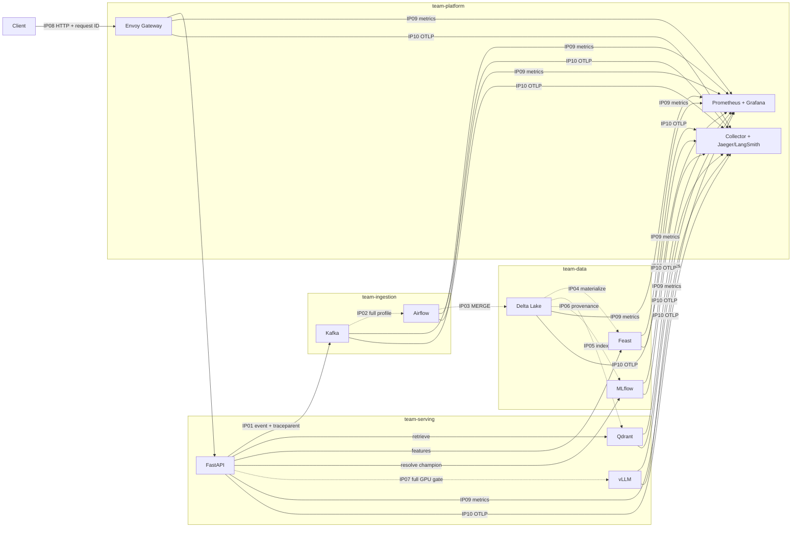

# Architecture and ownership

Solid arrows are exercised by the route-2 core run. Dashed arrows need the full
profile or the GPU gate. The presenter/incident-commander role owns the demo
sequence and the evidence index across all four technical owners.

| Owner | Integration points | State or contract owned |
|---|---|---|
| `team-ingestion` | IP01, IP02 | Kafka schemas, partition key, offsets, retry/DLQ, Airflow run |
| `team-data` | IP03, IP04, IP06 | Delta versions, Feast snapshot/materialization, MLflow release |
| `team-serving` | IP05, IP07 | deterministic vector IDs, retrieval, grounded prompt, vLLM identity |
| `team-platform` | IP08, IP09, IP10 | gateway policy, metrics/alerts, trace pipeline, K8s/GitOps |
| `team-presenter` | all | evidence index, incident narration, Q&A |
